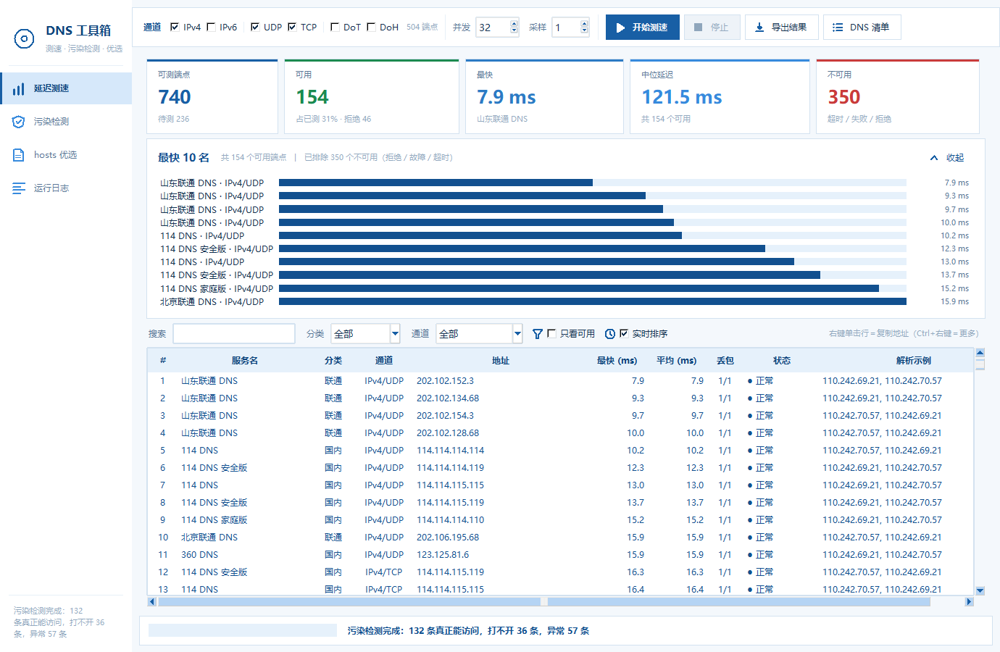
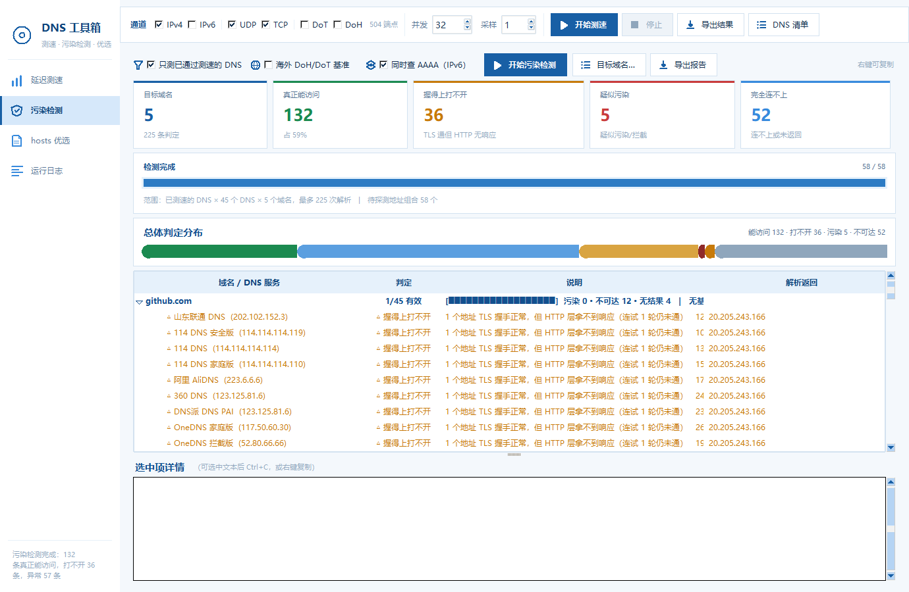
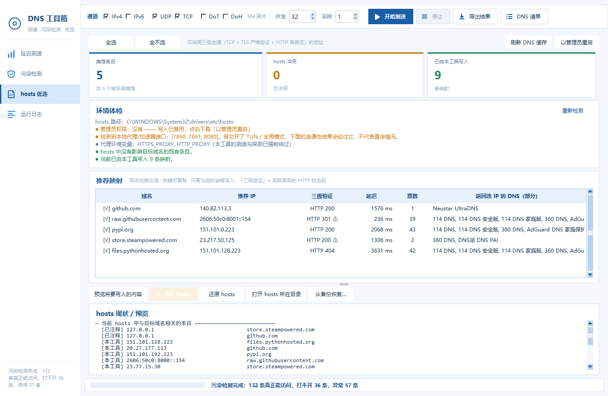

# DNS 测速与污染检测工具

一个纯本地运行的 Windows 小工具：批量测公共 DNS 的延迟、验证它们解析出来的地址
**到底能不能用**，并把验证通过的 IP 一键写进 hosts。

蓝白配色的图形界面（竖排侧栏导航），零第三方依赖（只用 Python 标准库），可打包成单文件 exe。

---

## 快速开始

**方式一：直接用 exe（推荐）**

到 [Releases](../../releases/latest) 下载 `DNSChecker.exe`，双击即用，不需要装 Python。
想用 hosts 写入功能的话，右键 →「以管理员身份运行」，或者在界面里点「以管理员重启」。

**方式二：从源码运行**

```bat
python main.py
```

**自己重新打包**

需要先装 PyInstaller（程序本身零依赖，但打包器要）：

```bat
pip install pyinstaller
python build.py
```

产出 `dist/DNSChecker.exe`（单文件，约 12 MB，双击即用、不依赖 Python 环境）。

---

## 界面





左侧竖排导航一条到底，四个页面：

```
DNS 工具箱
 ├ 延迟测速     统计卡片 + Top10 条形图 + 全量端点表格
 ├ 污染检测     实时进度 + 判定分布条 + 域名分组结果树
 ├ hosts 优选   环境体检 + 推荐映射 + hosts 现状
 └ 运行日志
```

四项都带矢量图标。图标是 `Canvas` 画的，**未知图标名不会静默留白** ——
会画一个显眼的占位方块并记进 `theme.UNKNOWN_ICON_KEYS`，
`verify_ui.py` 会断言这个集合是空的（见文件结构里的 `verify_ui.py`）。

**几个用起来顺手的点**

- **打开就把全部 740 个端点列出来**（灰色「待测」），不用等测速才有东西看
- 表格里**右键单击任意一行**＝直接复制该行的 DNS 地址（一步到位，不弹子菜单），
  光标旁边会闪一个「已复制」提示；想按列复制或复制整行时，**按住 Ctrl 再右键**弹完整菜单
- 所有勾选框与按钮都是**矢量图标**，图标底下垫了一块圆角色块 —— 试过纯细线轮廓，
  在浅色背景上会糊成一小团、看着像渲染杂讯，有底衬才一眼认得出是图标
- 污染检测**边跑边出结果**：解析完一条就填一条，探测完一个地址就更新一次状态
- 统计卡片和条形图随测速/检测**实时刷新**，不用等全部跑完

### 1 · 延迟测速

覆盖 **141 个 DNS 服务 / 740 个端点**。通道按 **地址族 × 传输方式** 两组勾选组合：

```
地址族   IPv4  IPv6          ← 走哪个地址族
传输层   UDP   TCP           ← 走哪个传输层
加密     DoT   DoH           ← 自带加密，不受上面两行影响
```

两组勾选是**正交**的，实际测的端点就是它们的组合：

| 勾选 | 测什么 |
|---|---|
| IPv4 + UDP | `udp4`，252 个 |
| IPv6 + UDP | `udp6`，81 个 |
| **IPv4 + TCP** | **`tcp4`，252 个** —— 国内有一批「UDP 被阻断、TCP 还通」的服务器 |
| **IPv6 + TCP** | **`tcp6`，81 个** |
| DoT / DoH | 23 / 51 个，自带加密 |

| 传输 | 底层 | 超时 |
|---|---|---|
| UDP | UDP 53 | 2s |
| **TCP** | **TCP 53（明文，2 字节长度前缀）** | 3s |
| DoT | TCP + TLS 853 | 4s |
| DoH | HTTPS 443，RFC 8484 | 5s |

勾选框右边会**实时显示当前组合会测多少个端点**（例如「504 端点」），不会出现勾空了还不知道的情况。

- 每个目标**采样 3 次取最小值**（最小值最接近真实链路延迟，不被单次毛刺污染）
- 查询域名用 `www.baidu.com` / `www.qq.com` 交替，都在各家热缓存里，横向可比
- **TCP 的延迟含三次握手**（建连单独计时，最终计入总耗时）—— 否则和 UDP 不在同一把尺子上
- 结果**按延迟从低到高排序**，不可用的行自动沉底；点列头可换排序依据
- 支持搜索、按分类/通道筛选、只看可用、导出 CSV

**明文 TCP 这条通道为什么值得单独列出来**：国内实测 `8.8.8.8` 的
**UDP:53 完全无响应，TCP:53 却是通的**。如果只测 UDP，这类服务器会被判成「超时」
而白白丢掉。另外，**同一台服务器 UDP 与 TCP 成绩差得离谱，
往往说明 UDP 层被 QoS 限速了**，这本身就是个有用的诊断信号。

### 响应码说人话，「拒绝」一律算不可用

非 0 的响应码直接显示中文：`REFUSED` → **拒绝**、`SERVFAIL` → 服务器故障、
`NXDOMAIN` → 域名不存在。表格状态列用三个前缀区分：

| 前缀 | 含义 |
|---|---|
| `● 正常` | 拿到了解析结果，**可用** |
| `✕ 拒绝` | 有响应，但没给出解析结果（拒绝 / 服务器故障 / 域名不存在）→ **不可用** |
| `○ 超时` | 连应答都没有 → 不可用 |

**「拒绝」这类服务器会被彻底当不可用处理**，而不是照它 20ms 的漂亮延迟排在最前面：

- 排序时**沉到所有可用行之后**（实测：注入一条 5.0ms 的拒绝记录，它排在第 267 位，
  前面 266 行全是可用行）
- **不计入**「可用 / 最快 / 中位延迟」三个统计卡
- **不进** Top 10 条形图（榜上标注「已排除 N 个不可用」）
- 勾「只看可用」会被过滤掉
- 导出 CSV 多一列「**可用**」（是 / 否），可以直接筛
- 「只测已通过测速的 DNS」也不会把它们送去做污染检测 —— 拿不到解析结果，白跑一轮

原因很简单：**REFUSED 的延迟是「假的好成绩」** —— 服务器 20ms 就回了包，
但它对你的实际价值是 0（典型原因是来源限制，如清华 TUNA `101.6.6.6` 只服务教育网）。
双击该行能看到完整解释：

```
响应码      : 拒绝（REFUSED）
注意        : 服务器收到了查询但拒绝为你解析 —— 通常是来源限制（只对特定网段开放）。
              它的延迟成绩是「假的好成绩」，不能用来挑 DNS。
```

（汉字为了好懂，标准 RFC 名称在括号里保留，排障时能对上。）

### 2 · 污染检测

对每个目标域名，逐个 DNS 解析 + 逐个 IP 做 **三级落地探测**：

```
① 每个 DNS 解析目标域名
② 返回的 IP 按 (IP, 域名) 全局去重
③ 每个 IP 走三级，失败自动重试一次：
     第 1 级  TCP 连 :443
     第 2 级  TLS 握手（SNI=域名，证书链 + SAN 严格校验）
     第 3 级  真的发一个 HTTP 请求，读到状态行才算过
```

**为什么一定要做到 HTTP 这一层**（都是实测数据）：

| 现象 | 实测案例 | 说明 |
|---|---|---|
| **握手成功 ≠ 能访问** | 某 IP 的 TLS 握手 448ms 就握上了，但 HTTP 层连试三轮全部超时 | 只测到 TLS 会把它判成「可用」——写进 hosts 之后打不开 |
| **TLS 失败 ≠ 不能用** | 某 IP 的 TLS 那一把被重置，实际 HTTP 三轮全部正常响应 | 只测到 TLS 会把它判成「疑似阻断」，白白丢掉一个好地址 |
| **链路本身在抖** | 同一 IP 三轮结果 `http:200 / dead / dead` | 单次采样不可靠，所以**失败要重试一次** |

**判定标准**：

| 判定 | 含义 |
|---|---|
| **解析有效** | 返回的地址至少有一个**三级全通** |
| **部分有效** | 有能访问的，也混着打不开 / 不稳 / 伪造的地址 |
| **握得上打不开** | TLS 严格验证都过了，就是 HTTP 层拿不到响应（单列一档，**不会被推荐**） |
| **疑似污染** | 证书与该域名不符 —— 有人在中间冒充 |
| **疑似阻断** | TCP 能连，但 TLS 被中断且抓不到证书 |
| **明确拦截** | 返回 `0.0.0.0` / 回环 / 内网地址 |
| **结果不可达** | 返回了地址，但 TCP 都连不上 |

**单个 IP 的落地分级**（详情面板里能看到三级各自的耗时）：

| 分级 | 含义 |
|---|---|
| **可用** | TCP 通 + TLS 严格验证通过 + **HTTP 拿到响应** |
| **可用(不稳)** | 握手这一把没走通，但**抓到的证书如实覆盖该域名** → 是真身，只是链路不稳 |
| **握手可过但打不开** | TLS 严格验证通过，但 HTTP 层反复拿不到响应 |
| 疑似劫持 | 抓到了证书，但证书跟这个域名对不上 |
| 疑似阻断 | TCP 通，TLS 被中断且抓不到证书 |
| 不可达 | TCP 根本连不上 |

> **不看 HTTP 状态码是几，只看有没有响应。** 实测 `objects.githubusercontent.com`
> 的根路径本来就返回 404、`raw.githubusercontent.com` 返回 301 跳到真实路径 ——
> 它们都完全可用。状态码代表服务器的策略，**三层链路是通的**才是「能不能访问」。

**「握手可过但打不开」为什么单列一档**：它既不是污染（证书完全正确），
也不该混进「解析有效」—— 用户照着选会写进 hosts，然后发现还是打不开。
这一类地址在旧版会被误判成「可用」，现在会被明确标出来并且**不参与推荐**。

**推荐写 hosts 的地址只从「三级全通」里挑**，排序是
**稳定通过 → IPv4 优先 → 延迟升序 → 票数**。
「重试才通」的地址排在稳定地址之后（延迟再低也不越过），推荐表格里带 ⚠ 标记，
并直接显示实测拿到的 HTTP 状态码。

**为什么以证书为铁证**：证书由站点真实 CA 签发，劫持方伪造不了（除非在你机器上
装了根证书做中间人）。所以「严格验证通过」意味着这个 IP 上真的跑着那个站点。

**「可用(不稳)」这一档很关键**：GitHub / PyPI 这类站点的 IP 在国内是**间歇性**被阻断的，
同一把 TLS 可能超时、下一把就通。如果不加这一档，真服务器会被误判成「疑似劫持」。

**支持 A 与 AAAA 双查询**：勾选「同时查 AAAA（IPv6）」后，同一个 DNS 的 A 与 AAAA
结果会**合并**显示在同一行（详情面板里能看到「查询类型：A + AAAA」），
IPv4 与 IPv6 地址都会列出来。推荐写入 hosts 的 IP **同档优先 IPv4**
（hosts 里写 IPv6 字面量，部分软件兼容性一般；但如果 IPv4 全都不稳而 IPv6
严格验证通过，仍然会选 IPv6）。

**两层基准参照**：

1. **本地共识 IP** —— 被多个不同 DNS 共同返回的地址更可能是真的（永远可用）
2. **海外加密 DNS** —— Cloudflare / Google / Quad9 / DNS.SB / AdGuard 的解析结果并集，
   **DoH 与 DoT 两条通道都试**（可通性随线路而变，多一个源就多一次机会）

> 实测在国内直连这些海外源基本不通，所以第 2 层经常自动跳过，判定退回第 1 层。
> 这不影响结论 —— GitHub 的真实 IP 就是靠共识统计认出来的。

**一句必须说清楚的话**：在国内网络下，GitHub 的**真实 IP 本身**也可能连不上。
所以「结果不可达」**不等于**「这个 DNS 污染了」。能确凿判定的只有两种情况：
返回了明显伪造的地址（明确拦截 / 证书不符），以及返回了通过 TLS 验证的可用地址。

### 3 · hosts 优选



把上一步验证过的 IP 写进 hosts，按「严格验证优先 → 延迟低优先 → 票数次之」排序推荐。
推荐表里直接给出**三级验证得到的 HTTP 状态码**和票数，「重试才通」的地址带 ⚠ 标记。

内置环境体检，会直接告诉你：

- 是否具备管理员权限
- 本机有没有挂代理/加速器（有的话连通性结果会被代理接管，不代表直连）
- hosts 里有没有影响目标域名的既有条目

**写入规则（从紧设计）**：

1. 写入前**自动备份**成 `hosts.bak.<时间戳>`，备份失败就中止
2. 所有内容放进一个**带标记的区块**，区块外的行一律不动
3. 命中目标域名、又在标记区块外的既有条目会被**注释掉**（不是删除）
4. 「还原 hosts」= 删掉标记区块 + 撤销注释前缀，其余内容逐字不变
5. 每条都做合法性校验（必须是合法 IP + 合法域名），避免行注入
6. **写入/还原后自动刷新系统 DNS 缓存**（见下）

### 改完 hosts 必须刷新缓存，否则等于没改

Windows 的 DNS Client 服务（Dnscache）会把解析结果**连同 hosts 的结果一起缓存**，
改完 hosts 它**不会自动失效**。不刷的话，用户写完 hosts 打开浏览器拿到的还是旧 IP，
会以为工具没起作用 —— 所以这一步不能省。

刷新走 `dnsapi.DnsFlushResolverCache`（`ipconfig /flushdns` 的底层函数），
比起子进程好在三点：**零进程开销（实测 ~0.5ms）、不弹黑框、不需要管理员权限**。

| 时机 | 行为 |
|---|---|
| 写入 hosts 后 | 自动刷新 |
| 还原 hosts 后 | 自动刷新（否则缓存里还留着写进去的旧映射） |
| 从备份整体覆盖后 | 自动刷新 |
| 顺手在记事本里改过 hosts | 点「**刷新 DNS 缓存**」按钮手动刷 |

完成对话框会写明刷新结果；**万一刷新失败，会明确提示手动执行
`ipconfig /flushdns`**，而不是默默跳过。

> **一个系统刷新管不到的地方**：Chrome / Edge 有各自独立的 DNS 缓存，
> 系统刷新清不掉它。所以写入完成的提示里会附带一句
> 「若浏览器仍访问到旧地址，请重启浏览器」。

---

## 目标域名

默认 11 个：

```
GitHub   github.com / raw.githubusercontent.com
         objects.githubusercontent.com / codeload.github.com
PyPI     pypi.org / files.pythonhosted.org
Steam    store.steampowered.com / steamcommunity.com / api.steampowered.com
         cdn.akamai.steamstatic.com / media.steampowered.com
```

在「污染检测」页点「目标域名…」可自由增删，每行一个。

---

## 已知限制

- **海外加密 DNS（DoH / DoT）基准参照在国内直连基本不可用**，靠共识 IP 兜底
- **开着 TUN / 全局代理会污染结论**：连通性测试走的是代理而不是直连。
  体检面板会提示，建议测试时关掉
- **hosts 写入需要管理员权限**，非管理员时按钮禁用并提供提权重启
- **IPv6 通道需要本机真的有 IPv6 出口**，没有的话那 162 个 IPv6 端点会全超时
- **勾上 TCP 通道后端点数接近翻倍**（740 个），全量跑一遍明显更久。
  只想看「UDP 是否被限速」时可以先用通道筛选框单看某一类
- 一批服务器**不监听明文 TCP 53**（只做 UDP），它们会显示「失败(Refused)」——
  这是正常的，不是被墙
- 本工具**只做测试和写 hosts，不改系统 DNS 设置**。要换系统 DNS 请自行到
  「网络适配器 → 属性 → IPv4/IPv6 → 使用下面的 DNS 服务器」里改

---

## 文件结构

```
dnschecker/
├── main.py           入口
├── ui.py             主窗口：侧栏导航 + 顶栏参数 + 状态栏 + 日志页
├── ui_speed.py       延迟测速页
├── ui_pollute.py     污染检测页
├── ui_hosts.py       hosts 优选页
├── theme.py          蓝白主题：配色 / 字体 / ttk 样式 / 矢量图标 / 自绘按钮 / 图表组件
├── dnsproto.py       DNS 协议层（报文 / 五通道查询 / 三级落地探测 / 证书解析 / 响应码中英对照）
├── channels.py       并发测速引擎（UDP / TCP / DoT / DoH）
├── pollution.py      污染判定引擎（三级探测 + 归因 + 推荐 IP）
├── hostsmgr.py       hosts 读写、体检、DNS 缓存刷新
├── winshot.py        抓窗口内容（PrintWindow，锁屏/遮挡也能截，不抢鼠标）
├── dnsdata.py        内置 DNS 清单（141 服务 / 740 端点）
├── build.py          打包脚本（含图标生成）
├── selftest.py       协议层自检
├── test_tcp_rcode.py TCP 通道 + 汉字响应码 + 「可用/不可用」验证
├── test_http_probe.py 三级探测 / 重试 / 判定 / 推荐取舍验证
├── test_hosts_flush.py hosts 写入/还原后刷新 DNS 缓存（全程在临时文件上跑）
├── e2e_test.py       端到端真实验证
├── verify_ui.py      界面结构 / 性能 / 实时刷新 / 按钮三态 / 通道矩阵 / 图标绘制 / 顶栏排版
└── shot_exe.py       对**打包好的 exe** 截图（证明交付物里图标等确实在）
```

配置写在 `%USERPROFILE%\.dnschecker\config.json`，崩溃日志在同目录 `crash.log`。

---

## 数据来源

- https://dns.iui.im/ —— IPv4 / DoH / DoT
- https://dns.iui.im/ipv6/ —— IPv6 / DoH / DoT

两个页面的条目按「服务名」合并：同一家 DNS 的 v4、v6、DoH、DoT 归到一条记录，
因为真正关心的是「这家 DNS 好不好用」，而不是「这个 IP 通不通」。
清单可在程序里导出 JSON 自行增删，再导入回来。
